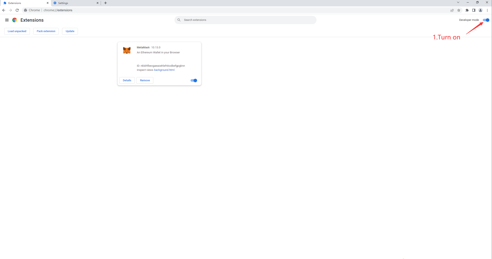
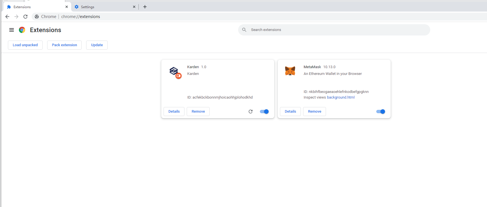

# Karden
Karden is a Web3 personal homepage that aims to afford the service of digital assets management, assets exhibition, and information integration.  Web2 developers can quickly start up their Web3 applications with optimized APIs supported by Karden.

Karden now has three core products——Kard, Kard Protocol and KardGrid.

Kard is a new type of NFT that points to an execution file designed with features like small size, dynamically loaded, cross-platform, and metadata possessed by the user.  There is no need to provide a real-name system, it publishes without official approval, and users can sell and purchase it within any NFT market.

KardProtocol provides API and NFT toolkits for developing Kard, which structure a Kard execution file and provide packaging and publishing tools to ensure it is loaded successfully by the container, while most Web 3.0 APIs have been packaged beforehand. It takes less than 30 minutes to start.

KardGrid is a cross-platform Kard loader maintained by the official, providing containers to load Kards and implement KardProtocol API. It can load any NFT on the page, including images, audio files, or apps. They will be exhibited properly. Users can compose NFTs as their wish by dragging and hauling.

Kard is implemented with full rendering performance on the browser engine, which fits better in interactive use cases like information monitoring, dynamic display, subscription notification, and quick tools. Therefore KardGrid becomes the personal space for users to manage their content sources, digital assets, and profiles —— more than just a dashboard.

Karden’ goal is to be the starting place for developers and general users who are willing to embrace Web3, by visualizing the digital assets on blockchain on an interactive interface and integrating fractional information on Web3. 

You can learn more about our project on [kard.cool](https://kard.cool)

#contract address
| name   | testnet(Ropsten)                           | mainnet(Polygon)                           |
| ------ | ------------------------------------------ | ------------------------------------------ |
| karden | 0xE154B6e2513591d7a20ef7B949e500E1FFBB8efA | 0xfe9193052ff2d1e3e25da15d060147b7fe98298b |

#Installation
Karden是一个Chrome插件，Demo阶段需要使用开发者模式安装

We packaged the product as a Chrome Web extension, at the current demo stage, users should install the extension via developer mode.

1.  Download `karden_demo.zip` and unzip the file

2.  Open Chrome,  enter **chrome://extenxions** in the address bar

3.  Turn on Developer mode

    

4.  Click **Load unpacked**，and select unzipped file you just download.

    

5.  Now Karden is your startup page.

# Tutorial

1.  We recommend you install Metamask Chrome web extension to connect Karden

2.  Open up startup page or Karden Webapp, click the offline button in the top right corner of the page to enter the system config popup.

3.  Click the button **Connect Your Wallet** and sign with your wallet to Karden.

4.  The current Karden page will bind to your wallet address as you sign to Karden

5.  Right mouse click on the page to call up the menu bar

6.  You can load your NFT or Kard on the page by clicking \*\*Add a new Kard \*\*

# How to get the Kards

1.  Click KardStore on your KardGrid, you can restore it from SystemKard once removed.

2.  Mint Kards that interest you most by clicking the **free mint** button below

3.  Once succeed to mint a Kard, you can find it in My Kards, just click + to add it to your Kard Grid.
